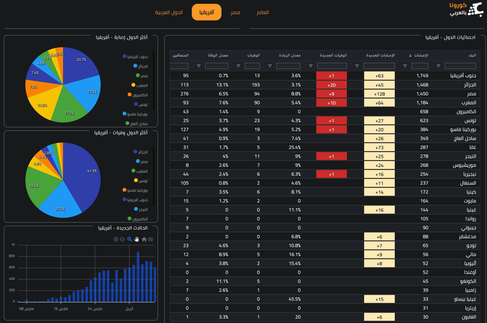

    

# Corona Bel3raby
A COVID-19 dashboard focused on Egypt & Arab League analytics.

Check out the site live at:  

# How to
- **Worldwide** Results

    

- **Egypt** Results

    

- **Africe** & **Arab League** Results

    

- Mobile Screenshots

  
  

# Sources
- [Worldometer](https://www.worldometers.info/coronavirus/)
- [JHU CSSE](https://github.com/CSSEGISandData/COVID-19/)

# Development Guidelines

## Backend
- Install python 3
- Install requirements.txt dependencies with pip
- Set the environment variable DATABASE_URL to db.dev location
- `python3 manage.py run` to run the API server
- Navigate to any of the API urls /api/reports

## Frontend
- Install node 10 or higher
- `npm install` to install the dependencies
- `npm run dev` to start nuxt development server